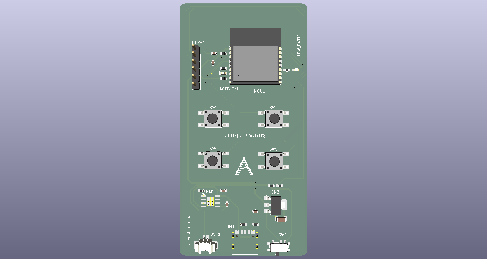
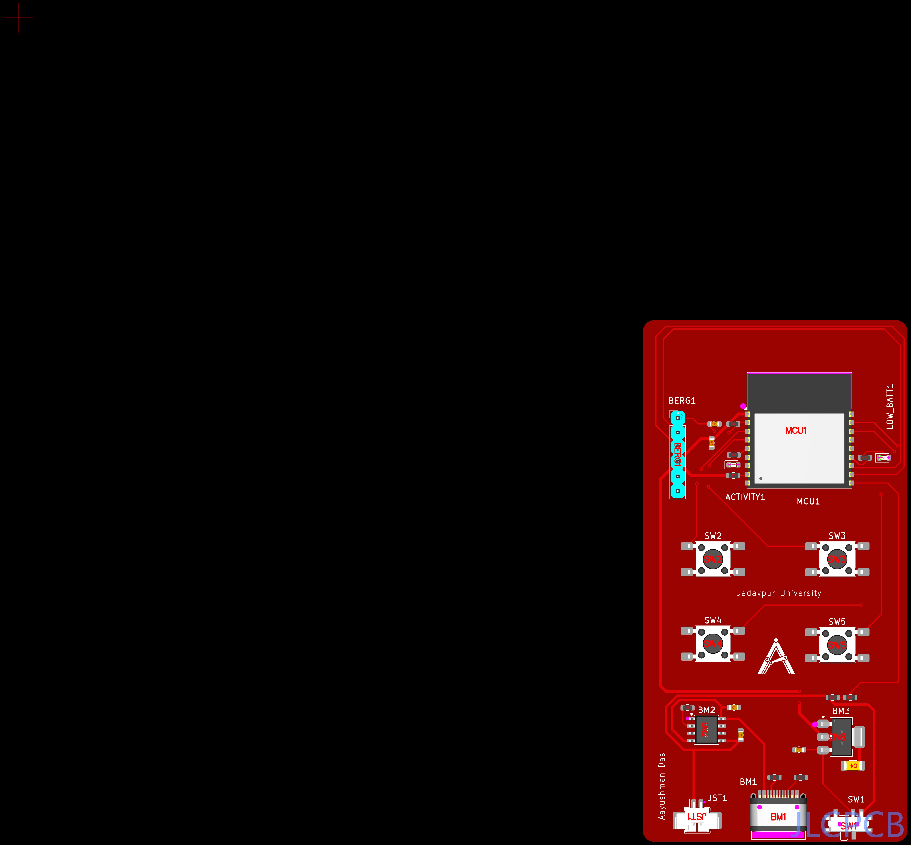

# ⚡ AuraClicker

A compact, battery-powered custom macro-pad and wireless input controller powered by the **ESP32-C3** RISC-V microcontroller. 

Designed natively in **KiCad** with end-to-end Design for Manufacturing (DFM) verification, ready for turnkey fabrication and assembly via JLCPCB SMT services.

---

## 📸 Media & Previews

| 3D PCB Preview | JLCPCB DFM Placement |
| :---: | :---: |
|  |  |

---

## ✨ Key Features

* **MCU Core:** ESP32-C3 RISC-V SoC (2.4 GHz Wi-Fi & Bluetooth 5 LE).
* **Power & Battery Management:**
  * Dedicated **TP4056** Li-Po linear charging IC over USB-C.
  * **AMS1117-3.3** high-current LDO for clean 3.3V power distribution.
  * 2-Pin **Molex PicoBlade (1.25mm)** battery connector. Recommended to be used with 3.7-4.2V 500mAh LiPo battery.
  * Hardware SPDT power slide switch (`SW1`).
* **Inputs & Peripherals:**
  * 4x Low-profile tactile click buttons (`SW2` – `SW5`) arranged for ergonomic thumb/finger reach.
  * Status LEDs for battery activity and low-power telemetry.
* **Programming & Debugging:**
  * Standard 1x6 (2.54mm) FTDI / UART header (`BERG1`) for serial programming and debug monitoring.

---

## 🗂️ Repository Structure

```text
AuraClicker/
├── kicad/                        # Raw KiCad project and PCB design files
│   ├── AuraClicker.kicad_pro
│   ├── AuraClicker.kicad_sch
│   ├── AuraClicker.kicad_pcb
│   ├── fp-lib-table
│   └── Team_Antarez_Logo.kicad_mod
│
├── production/                   # Fabrication-ready packages & CAD files
│   ├── AuraClicker_Fabrication.zip   # Gerber package ready for JLCPCB/PCBWay
│   ├── AuraClicker_BOM.xlsx          # Bill of Materials with LCSC part numbers
│   ├── AuraClicker_Placement.xlsx    # Pick & Place / Centroid coordinate file (.pos)
│   ├── AuraClicker_schem.pdf         # Printable PDF schematic
│   └── AuraClicker_Model.step        # Centered-origin 3D CAD STEP model
│
├── media/                        # Renders, schematics, and DFM validation captures
├── LICENSE
└── README.md
```

---

## 📌 Hardware Pin Mapping

| Peripheral | Reference | Net / Function | Active State |
| :--- | :--- | :--- | :--- |
| **Button 1** | `SW2` | Tactile Input | Active Low (Pull-up) |
| **Button 2** | `SW3` | Tactile Input | Active Low (Pull-up) |
| **Button 3** | `SW4` | Tactile Input | Active Low (Pull-up) |
| **Button 4** | `SW5` | Tactile Input | Active Low (Pull-up) |
| **Activity LED** | `D1` / `ACTIVITY1` | System Telemetry | Active High |
| **Low Batt LED** | `D2` / `LOW_BATT1` | Battery Warning | Active High |
| **Power Switch** | `SW1` | VBAT / VBUS Select | Hardware Cutoff |
| **UART Port** | `BERG1` | TX / RX / GND / 3V3 / DTR / RTS | 3.3V TTL Level |

---

## ⚠️ DFM Review & Assembly Notes (JLCPCB PCBA)

When placing a PCBA order via JLCPCB, verify the following manual adjustments during the **DFM Placement Review** step:

1. **`BERG1` (1x6 2.54mm Pin Header):**
   * *Rotation / Offset:* Rotate 90° and verify the 6 pins align over the through-hole pattern.
   * *Note:* If using **Economic PCBA**, through-hole components are not populated by default. Hand-solder this header manually upon delivery.
2. **`BM1` (USB-C 16-Pin Receptacle):**
   * *Placement:* Shift the component forward/inward along the Y-axis so the SMT signal pins land centered on the pads and the mechanical shield legs seat cleanly in their plated slots.
3. **`JST1` (Molex PicoBlade 1.25mm Header):**
   * *Placement:* Shift the component slightly inward (away from the outer PCB edge) along the Y-axis until the rear signal leads and side mechanical retention tabs center on their respective footprint pads.

---

## 🛠️ Fabrication & Ordering Quickstart

1. **Bare PCB Only:** Upload `production/Gerbers_AuraClicker.zip` to JLCPCB (FR-4, 1.6mm thickness, standard 2-layer).
2. **SMT Assembly:**
   * Enable **SMT Assembly**.
   * Upload `production/BOM_AuraClicker.csv` for the component list.
   * Upload `production/CPL_AuraClicker.csv` for pick-and-place centroid positions.
   * Product Category Recommendation: `Reserch\Education\DIY\Entertainment -> DIY Hobby Circuit Board` (*HS Code: 902300*).

---

## 📜 License & Trademark Notice

* **Hardware & Schematics:** Distributed under the **MIT License**. Feel free to modify, build, and redistribute the board.
* **Branding & Logos:** The **Team Antarez** insignia, logo graphics, and name are proprietary trademarks of Team Antarez. All rights reserved. You are free to manufacture and modify the hardware, but please remove proprietary team insignias from derivative or commercial releases.
